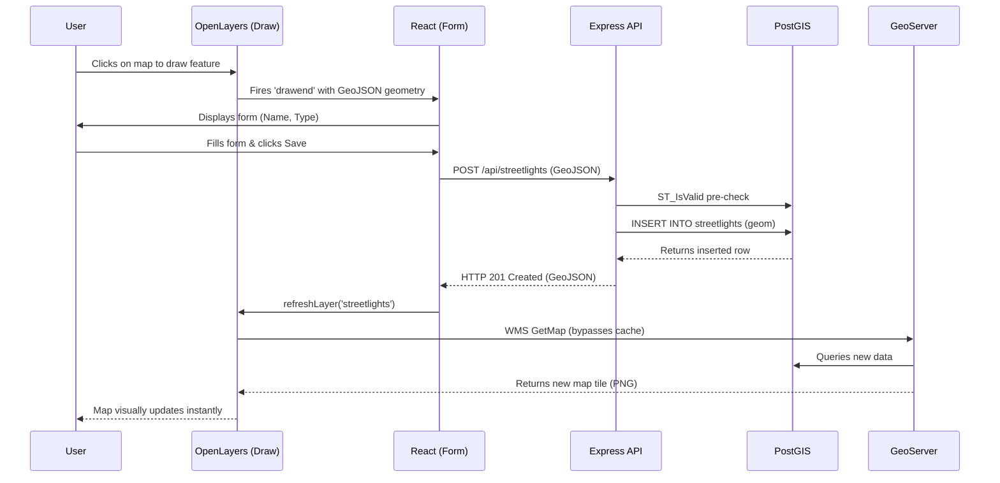

# Ward Infrastructure Manager

A GIS web application for managing municipal infrastructure across three spatial layers:
**streetlights** (Point), **roads** (LineString), and **zones** (Polygon).

---

## Architecture Overview

This project follows a strict two-path architecture. The read path and write path are completely
separate and must never be blurred. GeoServer owns display; the Express API owns mutations.

```
┌─────────────────────────────────────────────────────────────────────────────┐
│                           WARD INFRASTRUCTURE MANAGER                       │
└─────────────────────────────────────────────────────────────────────────────┘

  READ PATH  (map display — OpenLayers talks directly to GeoServer)
  ─────────────────────────────────────────────────────────────────
  OpenLayers ──WMS/WFS──► GeoServer ──────► PostGIS
     (browser)              (map server)    (spatial DB)

  • OpenLayers requests WMS tiles / WFS features directly from GeoServer.
  • GeoServer connects to PostGIS as its registered datastore.
  • The React frontend NEVER queries PostGIS directly.
  • The Express backend is NOT involved in any read / display request.


  WRITE PATH  (create / edit / move / delete — all mutations through the API)
  ─────────────────────────────────────────────────────────────────────────────
  OpenLayers ──event──► React ──fetch──► Express API ──pg──► PostGIS
     (browser)         (state)           (backend)           (spatial DB)

  • All write operations go through the Express REST API.
  • The API validates input, then executes parameterized SQL using PostGIS
    geometry functions (ST_GeomFromGeoJSON, ST_SetSRID, ST_AsGeoJSON, …).
  • GeoServer NEVER receives WFS-T (transactional) writes from the frontend.
  • After a successful write the frontend invalidates / refreshes the relevant
    OpenLayers WMS source so the map reflects the persisted change.

### Sequence Flow (Create Feature)




## Monorepo Layout

```
ward-management/
├── frontend/          React + OpenLayers SPA (Vite)
├── backend/           Node.js + Express REST API
├── db/                Plain-SQL migrations and seed scripts
├── docs/              GeoServer setup checklist and project notes
├── .gitignore
└── README.md
```

---

## Layers

| Layer        | Geometry     | PostGIS Table | GeoServer Layer   | Spatial Index (GiST) |
|--------------|--------------|---------------|-------------------|----------------------|
| States       | MultiPolygon | states        | ward:states       | idx_states_geom      |
| Districts    | MultiPolygon | districts     | ward:districts    | idx_districts_geom   |
| Zones        | Polygon      | zones         | ward:zones        | zones_geom_idx       |
| Roads        | LineString   | roads         | ward:roads        | roads_geom_idx       |
| Streetlights | Point        | streetlights  | ward:streetlights | streetlights_geom_idx|

All tables persist geometries in **SRID 4326** (WGS 84). All spatial queries use GiST indexes.

---

## Quick Start

### Prerequisites
- Node.js >= 20
- PostgreSQL 15+ with PostGIS 3
- GeoServer 2.25+ (configured with Jetty CORS enabled)
- Python 3.10+ with `geopandas`, `sqlalchemy`, `shapely`, `psycopg2` (for GIS data import)
- See [docs/geoserver-setup.md](./docs/geoserver-setup.md) for the mandatory setup checklist.

### Database Setup & Migrations
Run all migrations in order (001 through 009):
```bash
cd backend
npm run migrate
```
Or via Windows batch script:
```cmd
run_migrations.bat
```

To run the automated PostGIS and schema integrity check:
```bash
cd backend
node verify_phase2.js
```

### Administrative GIS Data Import
Import Indian State and District boundary shapefiles safely (non-destructive, transactional, auto-repairing):
```bash
# Append mode (safe default: only inserts missing records without table drops)
python import_geopandas.py --mode append

# Replace mode (safely truncates records in a transaction while preserving PKs, constraints & GiST indexes)
python import_geopandas.py --mode replace

# Dry run mode (validates CRS, geometry, and attributes without writing to database)
python import_geopandas.py --dry-run
```

### Backend
```bash
cd backend
cp .env.example .env
npm install
npm run dev
```

### Frontend
```bash
cd frontend
cp .env.example .env.development
npm install
npm run dev
```

---

## Environment Variables

### Backend (backend/.env)

| Variable            | Description                                      |
|---------------------|--------------------------------------------------|
| PORT                | Express server port (default 3001)               |
| DB_HOST             | PostgreSQL host                                  |
| DB_PORT             | PostgreSQL port (default 5432)                   |
| DB_USER             | PostgreSQL username                              |
| DB_PASSWORD         | PostgreSQL password                              |
| DB_NAME             | Database name                                    |
| CORS_ORIGIN         | Allowed frontend origin for CORS requests        |
| GEOSERVER_URL       | GeoServer base URL (cache invalidation)          |
| GEOSERVER_USER      | GeoServer admin username                         |
| GEOSERVER_PASSWORD  | GeoServer admin password                         |

### Frontend (frontend/.env.development)

| Variable                   | Description                              |
|----------------------------|------------------------------------------|
| VITE_API_BASE_URL          | Express backend base URL                 |
| VITE_GEOSERVER_BASE_URL    | GeoServer public base URL (WMS/WFS)      |
| VITE_GEOSERVER_WORKSPACE   | GeoServer workspace name (e.g. ward)     |

---

## API Reference

| Method | Path                    | Description            |
|--------|-------------------------|------------------------|
| GET    | /api/states             | List all states        |
| PUT    | /api/states/:id         | Update a state         |
| DELETE | /api/states/:id         | Delete a state         |
| GET    | /api/districts          | List all districts     |
| PUT    | /api/districts/:id      | Update a district      |
| DELETE | /api/districts/:id      | Delete a district      |
| GET    | /api/streetlights       | List all streetlights  |
| POST   | /api/streetlights       | Create a streetlight   |
| PUT    | /api/streetlights/:id   | Update a streetlight   |
| DELETE | /api/streetlights/:id   | Delete a streetlight   |
| GET    | /api/roads              | List all roads         |
| POST   | /api/roads              | Create a road          |
| PUT    | /api/roads/:id          | Update a road          |
| DELETE | /api/roads/:id          | Delete a road          |
| GET    | /api/zones              | List all zones         |
| POST   | /api/zones              | Create a zone          |
| PUT    | /api/zones/:id          | Update a zone          |
| DELETE | /api/zones/:id          | Delete a zone          |

Request / response bodies use **GeoJSON Feature** format.

---

## GIS Feature Management & Spatial Workflows

### 1. Spatial Hierarchy & Referential Integrity
The system models municipal assets in a strict 5-tier spatial and administrative hierarchy:

```
State (MultiPolygon)
  └── District (MultiPolygon)
        └── Zone (Polygon — Municipal Ward Boundaries)
              └── Road (LineString — Intersects Zone)
                    └── Streetlight (Point — DWithin 10m of Road)
```

- **Referential Integrity**: Foreign keys enforce hierarchy integrity (`roads.zone_id REFERENCES zones(id) ON DELETE RESTRICT`, `streetlights.road_id REFERENCES roads(id) ON DELETE RESTRICT`).
- **Deletion Protection**: Deleting a Zone with child Roads or a Road with child Streetlights is rejected by the database (PostgreSQL error 23503), mapped by Express to `HTTP 409 Conflict`, and surfaced directly to the operator in the HUD card and error toaster without modifying database constraints.

### 2. Feature ↔ Map Synchronization & Zooming
- **Bidirectional Selection**: Selecting a feature from the HUD search list highlights the feature on the map, centers the view, and synchronizes parent hierarchy context (`selectedZoneFeature`, `selectedRoadFeature`). Selecting on the map updates the HUD active card and scrolls the list item into view.
- **Zoom to Feature**: Re-centers and fits view to the selected asset's geometry (Point: zoom 18; LineString: maxZoom 16 with padding; Polygon: fits bounding box with padding). Fetches full geometry on-demand without unbounded downloads.
- **Zoom to Layer Extent**: Safe navigation to a layer's bounding box using loaded vector features, cached spatial extents, or GeoServer WMS `GetCapabilities` BoundingBox. Never triggers full-table WFS downloads.

### 3. GIS Mutation Request Discipline
Every spatial mutation follows strict request economy:
- **Move Feature**: Dragging emits 0 API requests. Releasing (`translateend`) executes exactly 1 `PUT` request. API failure rolls back the geometry locally.
- **Vertex Editing**: Inserting, dragging, or deleting vertices emits 0 API requests. Save produces exactly 1 `PUT` request. Cancel or Esc reverts to the original geometry with 0 requests.
- **Create Feature**: Drawing emits 0 API requests. Form submit produces exactly 1 `POST` request.
- **Delete Feature**: Requires 2-step confirmation and executes exactly 1 `DELETE` request.

---

## GeoServer Manual Publishing Workflow (States & Districts)

For Phase 5, the following steps must be performed manually in the GeoServer Admin GUI (`http://localhost:8080/geoserver`) to publish the administrative boundaries:

1. **Log in** with `admin` / `geoserver`.
2. **Navigate** to `Layers` -> `Add a new layer`.
3. **Select Store**: Choose the `ward:ward_db` PostGIS store.
4. **Publish Layer**: Locate `states` (and later `districts`) in the list and click **Publish**.
5. **Coordinate Reference System**: Ensure **Declared SRS** is exactly `EPSG:4326`.
6. **Bounding Boxes**:
   - Click **Compute from data** to generate the Native Bounding Box.
   - Click **Compute from native bounds** to generate the Lat/Lon Bounding Box.
7. **Save**: Scroll to the bottom and click **Save**.
8. **Verify**: Open OpenLayers (`http://localhost:5173`) and ensure the map layers render without full-table WFS requests.

See [docs/geoserver-setup.md](./docs/geoserver-setup.md) for the full initial configuration checklist.
