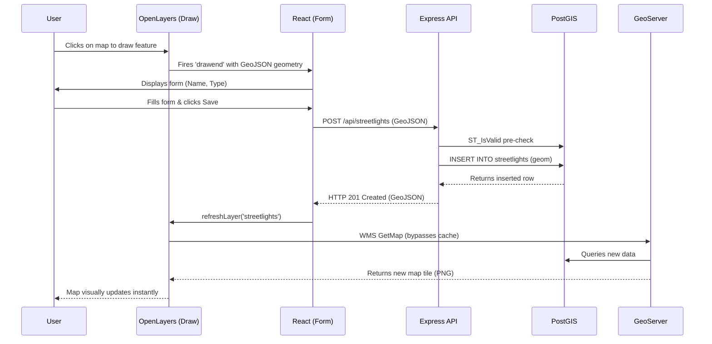

# Ward Infrastructure Manager

A GIS web application for managing municipal infrastructure across three spatial layers:
**streetlights** (Point), **roads** (LineString), and **zones** (Polygon).

---

## Architecture Overview

This project follows a strict two-path architecture. The read path and write path are completely
separate and must never be blurred. GeoServer owns display; the Express API owns mutations.

```
┌─────────────────────────────────────────────────────────────────────────────┐
│                           WARD INFRASTRUCTURE MANAGER                       │
└─────────────────────────────────────────────────────────────────────────────┘

  READ PATH  (map display — OpenLayers talks directly to GeoServer)
  ─────────────────────────────────────────────────────────────────
  OpenLayers ──WMS/WFS──► GeoServer ──────► PostGIS
     (browser)              (map server)    (spatial DB)

  • OpenLayers requests WMS tiles / WFS features directly from GeoServer.
  • GeoServer connects to PostGIS as its registered datastore.
  • The React frontend NEVER queries PostGIS directly.
  • The Express backend is NOT involved in any read / display request.


  WRITE PATH  (create / edit / move / delete — all mutations through the API)
  ─────────────────────────────────────────────────────────────────────────────
  OpenLayers ──event──► React ──fetch──► Express API ──pg──► PostGIS
     (browser)         (state)           (backend)           (spatial DB)

  • All write operations go through the Express REST API.
  • The API validates input, then executes parameterized SQL using PostGIS
    geometry functions (ST_GeomFromGeoJSON, ST_SetSRID, ST_AsGeoJSON, …).
  • GeoServer NEVER receives WFS-T (transactional) writes from the frontend.
  • After a successful write the frontend invalidates / refreshes the relevant
    OpenLayers WMS source so the map reflects the persisted change.

### Sequence Flow (Create Feature)




## Monorepo Layout

```
ward-management/
├── frontend/          React + OpenLayers SPA (Vite)
├── backend/           Node.js + Express REST API
├── db/                Plain-SQL migrations and seed scripts
├── docs/              GeoServer setup checklist and project notes
├── .gitignore
└── README.md
```

---

## Layers

| Layer        | Geometry   | PostGIS Table  | GeoServer Layer     |
|--------------|------------|----------------|---------------------|
| Streetlights | Point      | streetlights   | ward:streetlights   |
| Roads        | LineString | roads          | ward:roads          |
| Zones        | Polygon    | zones          | ward:zones          |

All tables use **SRID 4326** (WGS 84). Spatial indexes are GIST.

---

## Quick Start

### Prerequisites
- Node.js >= 20
- PostgreSQL 15+ with PostGIS 3
- GeoServer 2.25+ (configured with Jetty CORS enabled)
- See [docs/geoserver-setup.md](./docs/geoserver-setup.md) for the mandatory setup checklist.

### Backend
```bash
cd backend
cp .env.example .env
npm install
npm run dev
```

### Frontend
```bash
cd frontend
cp .env.example .env.development
npm install
npm run dev
```

### Database
```bash
psql -U postgres -d ward_db -f db/migrations/001_enable_postgis.sql
psql -U postgres -d ward_db -f db/migrations/002_create_streetlights.sql
psql -U postgres -d ward_db -f db/migrations/003_create_roads.sql
psql -U postgres -d ward_db -f db/migrations/004_create_zones.sql
psql -U postgres -d ward_db -f db/seeds/seed_sample_data.sql
```

> [!NOTE]
> The `seed_sample_data.sql` script loads sample infrastructure data centered around **Chennai, India**. When you boot up the frontend map, it will automatically focus on this region.

---

## Environment Variables

### Backend (backend/.env)

| Variable            | Description                                      |
|---------------------|--------------------------------------------------|
| PORT                | Express server port (default 3001)               |
| DB_HOST             | PostgreSQL host                                  |
| DB_PORT             | PostgreSQL port (default 5432)                   |
| DB_USER             | PostgreSQL username                              |
| DB_PASSWORD         | PostgreSQL password                              |
| DB_NAME             | Database name                                    |
| CORS_ORIGIN         | Allowed frontend origin for CORS requests        |
| GEOSERVER_URL       | GeoServer base URL (cache invalidation)          |
| GEOSERVER_USER      | GeoServer admin username                         |
| GEOSERVER_PASSWORD  | GeoServer admin password                         |

### Frontend (frontend/.env.development)

| Variable                   | Description                              |
|----------------------------|------------------------------------------|
| VITE_API_BASE_URL          | Express backend base URL                 |
| VITE_GEOSERVER_BASE_URL    | GeoServer public base URL (WMS/WFS)      |
| VITE_GEOSERVER_WORKSPACE   | GeoServer workspace name (e.g. ward)     |

---

## API Reference

| Method | Path                    | Description            |
|--------|-------------------------|------------------------|
| GET    | /api/streetlights       | List all streetlights  |
| POST   | /api/streetlights       | Create a streetlight   |
| PUT    | /api/streetlights/:id   | Update a streetlight   |
| DELETE | /api/streetlights/:id   | Delete a streetlight   |
| GET    | /api/roads              | List all roads         |
| POST   | /api/roads              | Create a road          |
| PUT    | /api/roads/:id          | Update a road          |
| DELETE | /api/roads/:id          | Delete a road          |
| GET    | /api/zones              | List all zones         |
| POST   | /api/zones              | Create a zone          |
| PUT    | /api/zones/:id          | Update a zone          |
| DELETE | /api/zones/:id          | Delete a zone          |

Request / response bodies use **GeoJSON Feature** format.

---

## GeoServer

See [docs/geoserver-setup.md](./docs/geoserver-setup.md) for the manual configuration checklist.
